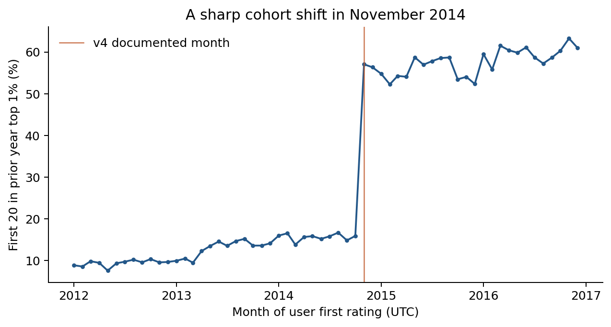

## Research question and contribution

MovieLens is both a recommender and the source of a widely reused rating dataset. Its interface determines which movies people encounter, how predicted scores are displayed, and which new users remain long enough to be sampled. We ask: **How did changes in MovieLens onboarding, list ordering, and catalog policy coincide with the concentration of users' ratings on already popular movies? Are users with niche tastes stable across eras?** A later, secondary question asks whether recommenders trained on the resulting data amplify concentration further.

The distinct contribution is a historical account of the feedback loop between platform design and its data. [Abdollahpouri et al. (2019)](https://arxiv.org/abs/1907.13286) showed that recommender outputs can concentrate on popular items even for niche users; this project examines conditions under which the underlying MovieLens rating record developed. [Harper and Konstan (2015)](https://doi.org/10.1145/2827872) document the relevant changes: v3 began in February 2003 with a new rating scale and onboarding requirement, members gained the ability to add films in September 2008, and v4 began in November 2014 with a different new-user process and popularity blended into list ordering. We will use these as event markers, not as proof that any one change caused an observed shift.

## Dataset collection and orientation

We downloaded the [MovieLens 32M release and README](https://files.grouplens.org/datasets/movielens/ml-32m-README.html) from GroupLens and verified all four published MD5 checksums. The release contains **32,000,204 ratings**, **2,000,072 tag applications**, **200,948 users**, and **87,585 catalog entries**. The README says users were randomly selected from those with at least 20 ratings; the files confirm the floor but cannot test the random-selection claim. They include anonymized user and movie IDs, star ratings, entry timestamps, title and genre labels, tags, and external movie IDs. They contain **no demographics**, impression logs, displayed predictions, or true viewing dates.

The ratings are structurally clean: no duplicated user–movie pairs, invalid rating values, or rated movie IDs absent from the catalog. **3,153 entries have tags but no ratings**, consistent with the README's inclusion rule. Release years can be parsed from **86,968 titles**; **617** fail, including titles without a trailing year or with malformed parentheses. Rating counts are strongly skewed. The median user has **73 ratings**, and **11.5%** of users have 20–25 ratings, close to the sampling floor. Among **84,432 rated entries**, the median has **5 ratings** and **48.0%** have fewer than five. The most rated entry, *The Shawshank Redemption (1994)*, has **102,929**. The top **1%** of rated entries receive **54.9%** of all ratings; the top **10%** receive **95.7%**. A five-rating title is *Hellhounds on My Trail (1999)*; *Condo Painting (2000)* has one rating. These comparisons describe MovieLens activity, not population-level movie tastes.

The timestamp range requires special care. **2,159,894 ratings from 33,358 users** are dated before August 1997, although Harper and Konstan place launch in August/fall 1997. Their paper also says the earlier EachMovie seed ratings were not included in MovieLens releases. We cannot resolve the discrepancy from the public tables, so we will investigate it and omit this period from the main era comparison. Rating timestamps mark entry rather than viewing: with a 30-minute session rule, **66.7%** of ratings occur in sessions of at least 50 entries; a 60-minute rule yields **67.7%**. The median first session has **47** ratings under the 30-minute rule. These patterns make viewing-time interpretations untenable.

## Exploratory result that refines the plan

For each user's first 20 ratings, we measured whether a movie was already in the top 1% of films with a prior MovieLens rating, using counts accumulated **through the end of the preceding calendar year**. Excluding users whose first rating predates January 1998 leaves **35,717 pre-v3**, **62,900 v3**, and **67,933 v4+** users. The first-20 share going to already popular films is **8.58%**, **8.58%**, and **66.05%** across those cohorts. Using popularity computed over the *entire* export instead gives **63.04%**, **63.52%**, and **85.02%**. The gap shows that look-ahead changes the measure substantially. The v4-era rise is striking, but could reflect onboarding, list ordering, catalog growth, movie age, cohort composition, or several together. It is a target for careful comparison, not a causal finding.

The monthly view sharpens the event timing: **267 users** whose first rating was in **October 2014** sent **15.9%** of their first 20 ratings to the prior-year top 1%; for **435 users** starting in **November 2014**, the share was **57.1%**. The site's documented v4 rollout was in November. This discontinuity warrants a fixed-catalog and within-month analysis because the exact launch day is not documented in our source.

{ width=5.2in }

## Proposed analysis and feasibility

1. **Platform-era comparison.** Plot first-20 and first-session concentration for monthly first-rating cohorts around February 18, 2003 and November 2014, with cohort sizes, pre-trends, and uncertainty intervals. Repeat with previous-month popularity, a fixed pre-event film set, and the full-data definition as sensitivity checks. Treat the September 2008 catalog rule separately, using first-rating date only as a proxy for catalog entry.
2. **Niche-user stability.** Define mainstreamness from the median prior-year popularity percentile of a user's rated movies. Follow users who contribute enough ratings in more than one era, describe attrition, and compare within-user change with overall cohort change. Report how the result depends on minimum history and film availability.
3. **External check.** Join [IMDb's non-commercial title and vote datasets](https://www.imdb.com/interfaces/) by MovieLens's linked IMDb ID. We matched title records for **87,355 entries (99.7%)** and vote counts for **87,226 (99.6%)**; **84,108** entries have both a MovieLens rating count and an IMDb vote count. The correlation of log counts is **0.850**, while about **2,000** entries fall in each mixed-popularity top-decile cell. IMDb is a current snapshot, collected after MovieLens ends in 2023, so we will stratify by film age and avoid calling its counts historical popularity. IMDb alternative-title fields do not establish original language or production country; that extension needs reliable production metadata.

\newpage

## Interpretation and decision rules

The sample sizes support descriptive era and subgroup analyses. They do **not** support direct inference about unseen exposures, users who failed onboarding, individual viewing dates, or design causality. The 20-rating minimum selects successful users. We will label as *documented* the site history described by Harper and Konstan, as *observed* the values computed from this export, and as *hypotheses* explanations for discrepancies. No recommender training is needed for this proposal. Later model comparisons, if pursued, will use chronological splits and a popularity baseline before more expensive training.

The main result will be evaluated against three alternative explanations. First, a changed movie universe could alter the top-1% cutoff even if people behaved identically, so we will repeat the comparison on a fixed pre-event catalog. Second, different kinds of users may have joined after v4, so we will compare first-session size and later activity alongside concentration. Third, calendar-year popularity is coarse near an event; we will recompute it using a preceding-month window. A claimed historical shift will need to persist under these checks. We will show cohort counts for every month and avoid interpreting small groups as stable trends.

## Work plan and immediate deliverable

By **October 8**, the team will submit this proposal as a PDF (maximum five pages), with the reproducible [EDA notebook](../notebooks/01_dataset_orientation.ipynb), [findings](eda_findings.md), [key-number table](key_numbers.md), [open questions](open_questions.md), and eight labeled figures as supporting material. Next, we will verify the pre-launch records, implement month-level and fixed-catalog sensitivity checks, and then assess within-user stability. Any claim about amplification by a trained recommender will follow the historical analysis and be presented as a secondary result.

The next analysis milestone will produce an event plot with the same denominator before and after v4, a table of who is included and excluded, and an investigation log for the pre-launch anomaly. The team will then decide whether the evidence supports a narrower claim about onboarding, a broader claim about platform-era association, or only a descriptive account of changing ratings. The external comparison will be retained as context even if language and country metadata remain unavailable.

## References

- GroupLens. *MovieLens 32M README*. https://files.grouplens.org/datasets/movielens/ml-32m-README.html
- F. Maxwell Harper and Joseph A. Konstan. 2015. “The MovieLens Datasets: History and Context.” *ACM Transactions on Interactive Intelligent Systems* 5(4), Article 19. https://doi.org/10.1145/2827872
- Himan Abdollahpouri, Masoud Mansoury, Robin Burke, and Bamshad Mobasher. 2019. “The Unfairness of Popularity Bias in Recommendation.” https://arxiv.org/abs/1907.13286
- IMDb. *Non-Commercial Datasets*. https://www.imdb.com/interfaces/
